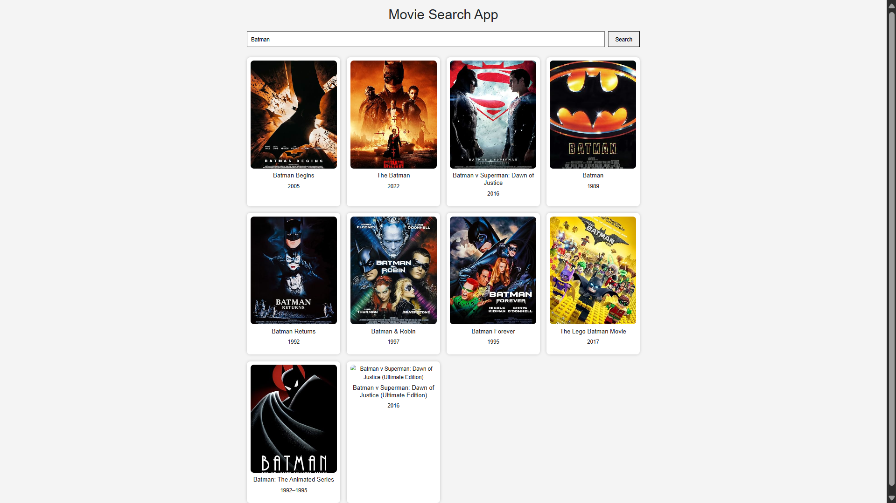

# 🎬 React Movie Search App

A simple and responsive Movie Search App built using React.js. Users can search for movies and view movie posters, titles, and release years using the OMDb API.

## 🚀 Live Demo

https://lakshmipriyas-25.github.io/react-movie-search-app/

## 📂 Source Code

https://github.com/LAKSHMIPRIYAS-25/react-movie-search-app.git

---

## ✨ Features

- 🔍 Search movies by title
- 🎬 Display movie posters
- 📅 Show movie release year
- ⏳ Loading indicator while fetching data
- ❌ Movie Not Found message
- 🖼️ Default poster for unavailable images
- 📱 Responsive design

---

## 🛠️ Technologies Used

- React.js
- JavaScript (ES6+)
- HTML5
- CSS3
- Bootstrap 5
- OMDb API
- Vite

---

## 📁 Project Structure

```
react-movie-search-app/
│
├── public/
│
├── src/
│   ├── assets/
│   │   └── screenshot.png
│   │
│   ├── App.jsx
│   ├── App.css
│   ├── main.jsx
│   └── index.css
│
├── .env
├── .gitignore
├── index.html
├── package.json
├── package-lock.json
├── vite.config.js
└── README.md
```

---

## 📸 Screenshot



## ⚙️ Installation

```bash
git clone https://github.com/LAKSHMIPRIYAS-25/react-movie-search-app.git

cd react-movie-search-app

npm install

npm run dev
```

---

## 🔑 Environment Variable

Create a `.env` file in the project root.

```env
VITE_OMDB_API_KEY=YOUR_API_KEY
```

---

## 📚 What I Learned

- React Components
- JSX
- useState
- useEffect
- Fetch API
- Async / Await
- API Integration
- Conditional Rendering
- Loading State
- Array map()
- Environment Variables
- Error Handling

---

## 👩‍💻 Author

**Lakshmi Priya S**

GitHub: https://github.com/LAKSHMIPRIYAS-25

---

⭐ If you found this project helpful, please consider giving it a star!